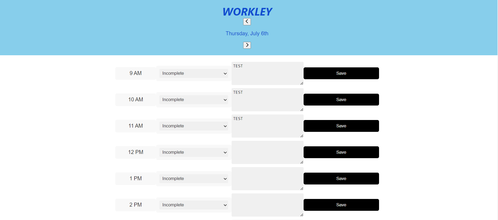

# Workley

This is a simple work day scheduler web application that allows users to create and manage their daily schedule. The application provides time blocks for standard business hours (9 AM to 5 PM) and allows users to save events for each time block. The time blocks are color-coded to indicate whether they are in the past, present, or future. The saved events persist even after refreshing the page.

## Features

- Display of current day at the top of the calendar
- Scrollable time blocks for standard business hours
- Color-coded time blocks based on past, present, and future
- Ability to enter events for each time block
- Saving and persistence of events using local storage
- Previous and next day navigation buttons

## Technologies Used

- HTML
- CSS
- JavaScript
- jQuery
- Moment.js
- Font Awesome

## Usage

1. Clone the repository or download the source code.
2. Open the `index.html` file in a web browser.
3. The current date will be displayed at the top of the calendar.
4. Scroll down to view the time blocks for standard business hours.
5. Each time block is color-coded to indicate whether it is in the past, present, or future.
6. Click on a time block to enter an event.
7. Click the save button for that time block to save the event.
8. The saved event will be stored in the local storage and persist even after refreshing the page.
9. Use the previous and next day buttons to navigate between different days.

## Screenshots

## Contributing

Contributions are welcome! If you find any issues or have suggestions for improvements, please feel free to create a pull request or submit an issue in the repository.

## License

The project is licensed under the [MIT License](LICENSE).
